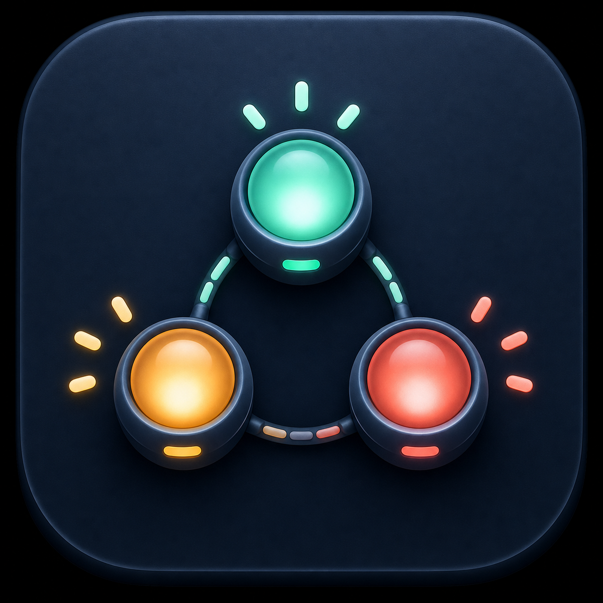
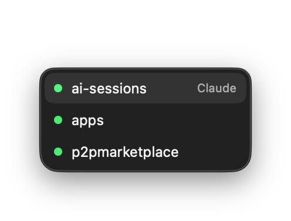
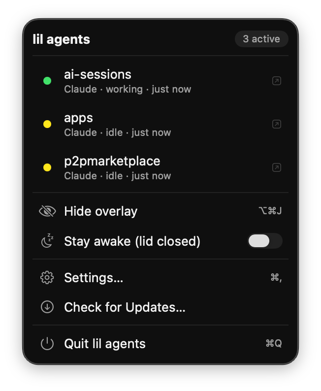
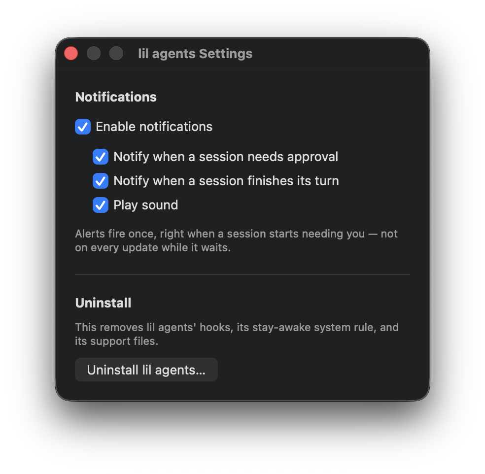

<p align="center">
  
</p>

<h1 align="center">lil agents</h1>

<p align="center">A live status overlay for Claude Code &amp; Codex CLI sessions on macOS.</p>

---

**Stop alt-tabbing to check if your AI coding agent is done.** `lil agents` (aka **AgentDeck**) is a tiny, native macOS menu-bar app that shows the live status of every [Claude Code](https://docs.anthropic.com/en/docs/claude-code) and [OpenAI Codex CLI](https://developers.openai.com/codex/) session in an always-on-top overlay — working, idle, or waiting for you — and lets you jump straight to the terminal pane that needs attention.

> Built for developers running **multiple AI agents in parallel** across terminal tabs and windows. One glance tells you which session is blocked on a permission prompt, which finished its turn, and which is still crunching.


<p align="center">
  
  &nbsp;&nbsp;
  
</p>

<p align="center"><sub>The always-on-top overlay (left) — compact by default, revealing which agent owns a row on hover — and the menu-bar menu (right), with per-session status, agent, and last-update time.</sub></p>

<p align="center">
  
</p>

<p align="center"><sub>Settings — choose which states alert you, whether they play a sound, and uninstall cleanly.</sub></p>

---

## Why lil agents?

When you drive several coding agents at once, they spend most of their time out of sight — in a background tab, another window, or a pane you scrolled away from. You end up context-switching constantly just to check "is it waiting on me yet?"

`lil agents` collapses that whole problem into a **single traffic-light glance**:

- 🔴 **Red** — a session is **blocked on a permission / approval prompt** and needs you *now*.
- 🟡 **Yellow** — a session **finished its turn** and is waiting for your next prompt.
- 🟢 **Green** — a session is **actively working** (running a tool or thinking).

Click any session and it **jumps to the exact terminal pane that owns it** — across iTerm2, Terminal.app, WezTerm, and tmux — no more hunting through windows. And if you'd rather be told than glance, it can post a **Notification Center alert** (with optional sound) the moment a session needs you.

## Features

- **Real-time agent monitoring** — tracks Claude Code and Codex CLI sessions as they start, work, prompt, and finish.
- **Floating overlay** — a compact, translucent, always-on-top list of live sessions; hover a row to reveal which agent owns it. Toggle it anywhere with a global hotkey (**⌥⌘J**).
- **Menu bar status icon** — the menu-bar glyph changes color to reflect the most attention-worthy session (red → yellow → green), so you know the state without even opening the overlay.
- **One-click jump to terminal** — click a session (in the overlay or the menu) to focus the exact pane that owns it. Precise focus for **iTerm2, Terminal.app, WezTerm, and tmux** (matched by controlling TTY / pane id); **Ghostty** gets precise split focus too via its AppleScript API (working-directory match on 1.3.0+, exact TTY match on 1.4.0+/tip), falling back to bringing the app forward on older builds.
- **Notification Center alerts** — optionally get a banner (and sound) the instant a session goes **🔴 needs-approval** or **🟡 finished-its-turn**. Fires once per transition; tap the alert to jump straight to that pane. Fully configurable in **Settings** (which states, sound, on/off).
- **Project-aware labels** — each session is labeled by its working-directory name, so you can tell your repos apart at a glance.
- **Stay awake (lid closed)** — an optional toggle keeps your Mac awake with the lid shut, so long agent runs don't get suspended mid-task.
- **Zero-config hook install** — one action wires the lifecycle hooks into both CLIs; config files are *merged, never clobbered*, and install is idempotent and self-healing.
- **Private by design** — everything is local. Events are sent over **loopback only** (`127.0.0.1:8787`), never your LAN, never the internet.
- **Native & lightweight** — pure Swift 6, SwiftUI + AppKit, no Electron, no bundled runtime. Dock-less and unobtrusive (`LSUIElement`).

## How it works

`lil agents` installs small **lifecycle hooks** into the CLIs you already use:

- **Claude Code** → `~/.claude/settings.json`
- **Codex CLI** → `~/.codex/hooks.json`

On each lifecycle event — `SessionStart`, `UserPromptSubmit`, `PreToolUse`, `Notification`, `Stop`, `SubagentStop`, and `SessionEnd` for Claude Code; `SessionStart`, `UserPromptSubmit`, `PreToolUse`, `PermissionRequest`, and `Stop` for Codex CLI — a tiny generated forwarder script reads the hook's JSON, tags it with the terminal's TTY, and `POST`s it to the app's local listener. The app maps those events to a coarse status (`working` / `idle` / `waitingApproval`) and updates the overlay and menu-bar icon instantly.

```
Claude Code / Codex CLI
        │  (lifecycle hook fires)
        ▼
 forward-event.sh  ──POST──▶  127.0.0.1:8787/event  ──▶  lil agents overlay + menu bar
   (adds tty/tool/event)          (loopback only)          🔴 🟡 🟢  +  jump-to-pane
```

Existing hooks from other tools and plugins are preserved — the installer only ever adds or removes its own entries.

## Requirements

- **macOS 26 or later**
- **Swift 6.2 toolchain** (Xcode 26+) to build from source
- A supported terminal for click-to-jump — **[iTerm2](https://iterm2.com/)**, **Terminal.app**, **[WezTerm](https://wezterm.org/)**, or **[tmux](https://github.com/tmux/tmux)** for precise pane focus (**[Ghostty](https://ghostty.org/)** 1.3.0+ also gets precise split focus via its AppleScript API; older Ghostty falls back to app-activate). Sessions are still *tracked* in any terminal — this only affects jump-to-pane.
- **Claude Code** and/or **Codex CLI** installed — whichever agents you want to monitor

## Download & Install

The easiest way to get `lil agents` is a signed, notarized build from the [Releases page](https://github.com/alfonsocartes/lil-agents/releases):

1. Download the latest `lil-agents-<version>.dmg`.
2. Open the `.dmg` and drag **lil agents.app** onto the **Applications** shortcut.
3. Launch it from Applications (or Spotlight).

Releases are signed with a Developer ID certificate and notarized by Apple, so macOS Gatekeeper opens it right up — no "unidentified developer" warning, no need to right-click → Open.

`lil agents` has no Dock icon and no main window; look for it in the **menu bar**.

## Updating

`lil agents` checks for updates automatically in the background via [Sparkle](https://sparkle-project.org/) and will prompt you when a new version is ready to install.

To check manually: menu bar → **Check for Updates…**

## Install & build

To build from source instead of downloading a release, clone and build the `.app` with the included script:

```bash
git clone https://github.com/alfonsocartes/lil-agents.git
cd lil-agents
scripts/build-app.sh          # release build → dist/lil agents.app
open "dist/lil agents.app"
```

Or build the raw binary with SwiftPM:

```bash
swift build -c release
```

Run the test suite with:

```bash
swift test
```

On first launch, use the app's install action to wire up the CLI hooks, then start (or restart) a Claude Code or Codex session — it should appear in the overlay immediately.

> **First-run permissions:** macOS will show a one-time **Automation** prompt so the app can control your terminal when you jump to a pane. Local source builds are ad-hoc code-signed (release downloads are Developer ID signed and notarized), which is enough for this grant to persist across launches.

## Usage

| Action | How |
| --- | --- |
| Show / hide the overlay | Global hotkey **⌥⌘J**, or the menu-bar menu |
| Jump to a session's terminal | Click the session row (overlay) or menu item, or tap its notification |
| Configure notifications | Menu bar → **Settings…** (**⌘,**) |
| Keep Mac awake with lid closed | Menu bar → **Stay awake (lid closed)** |
| Quit | Menu bar → **Quit lil agents** (**⌘Q**) |

Status at a glance:

| Dot | Meaning |
| --- | --- |
| 🟢 Green | Working — running a tool or thinking |
| 🟡 Yellow | Idle — finished its turn, waiting for your prompt |
| 🔴 Red | Needs input — blocked on a permission/approval prompt |

## Privacy & security

- **Loopback only.** The listener binds to `127.0.0.1` and is never exposed to the network.
- **No telemetry.** Nothing leaves your machine. There is no analytics, no account, no cloud.
- **Non-destructive config edits.** Existing hooks are backed up and merged; uninstall removes only what `lil agents` added.

## Uninstalling

Menu bar → **Settings…** (**⌘,**) → **Uninstall lil agents…**

This removes everything `lil agents` added to your system:

- Its hook entries from `~/.claude/settings.json` and `~/.codex/hooks.json` (existing entries from other tools are left untouched)
- The generated forwarder scripts
- The **stay awake (lid closed)** `sudoers` rule, if it was ever enabled
- Its other support files (logs, generated config, etc.)

It then reveals **lil agents.app** in Finder so you can drag it to the Trash yourself — the uninstaller never deletes the app bundle for you.

## Tech stack

Swift 6 · SwiftUI · AppKit · Network.framework (embedded loopback listener) · UserNotifications · Carbon global hotkey · AppleScript/osascript + CLI (iTerm2 / Terminal.app / WezTerm / tmux / Ghostty automation) · Sparkle (auto-updates) · SwiftPM.

## Releasing (maintainer)

Releases are fully automated by [`.github/workflows/release.yml`](.github/workflows/release.yml):

1. Push a tag matching `vX.Y.Z` (e.g. `v0.2.0`) to `main`.
2. The workflow builds the app, re-signs it with a Developer ID certificate, notarizes and staples it, packages `lil-agents-<version>.zip` (the Sparkle update archive) and `lil-agents-<version>.dmg` (the first-download disk image), updates `appcast.xml` with the new release entry and pushes it back to `main`, and publishes a GitHub Release with both artifacts attached.
3. Existing installs pick up the update automatically the next time Sparkle checks the feed.

The workflow needs the following repository secrets configured under **Settings → Secrets and variables → Actions**:

| Secret | Purpose |
| --- | --- |
| `MACOS_CERTIFICATE_P12` | Base64-encoded `.p12` export of the Developer ID Application certificate + private key |
| `MACOS_CERTIFICATE_PASSWORD` | Password the `.p12` was exported with |
| `APPLE_DEVELOPER_ID` | Signing identity string, e.g. `Developer ID Application: Your Name (TEAMID)` |
| `APPLE_ID` | Apple ID email used for notarization |
| `APPLE_TEAM_ID` | 10-character Apple Developer Team ID |
| `APPLE_APP_PASSWORD` | App-specific password for `notarytool` (not your Apple ID password) |
| `SPARKLE_PRIVATE_KEY` | Sparkle EdDSA private key (base64, from `generate_keys`) used to sign update archives |

`GITHUB_TOKEN` is supplied automatically by Actions and is used to push the appcast update and create the release.

## Roadmap ideas

- Per-session elapsed-time and turn counts

Contributions and issues welcome.

## License

Released under the [MIT License](LICENSE). © 2026 Wandity Ltd.

---

<sub>**Keywords:** Claude Code monitor · Codex CLI status · AI coding agent dashboard · macOS menu bar app · terminal session overlay · parallel AI agents · iTerm2 jump-to-pane · Claude Code hooks · Codex hooks · agent session tracker · SwiftUI menu bar app.</sub>
