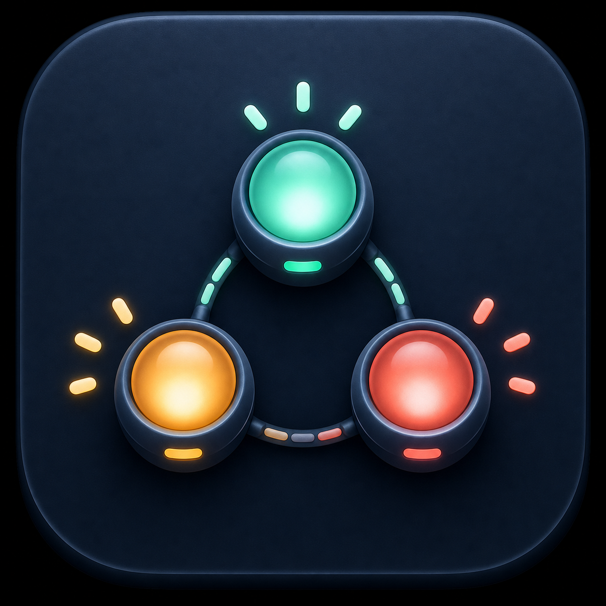
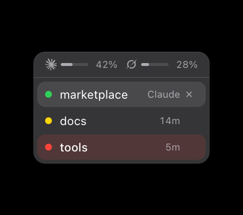
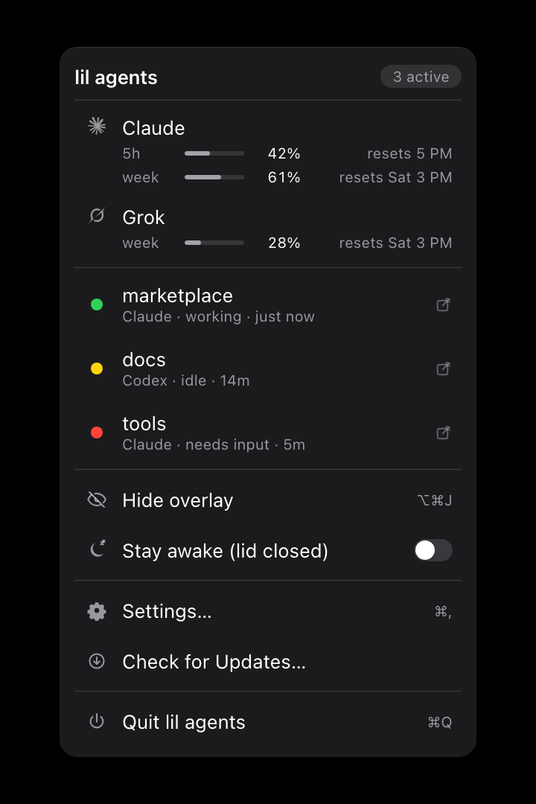
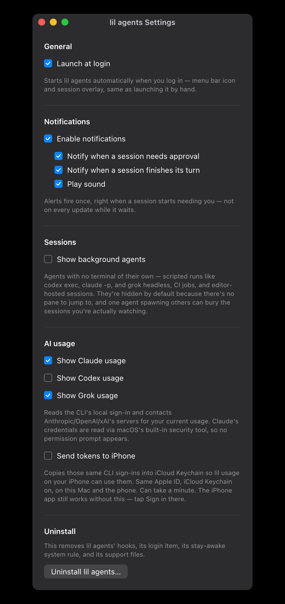
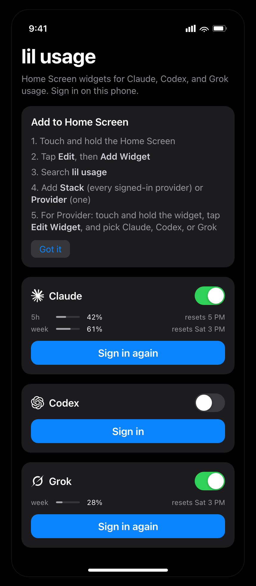
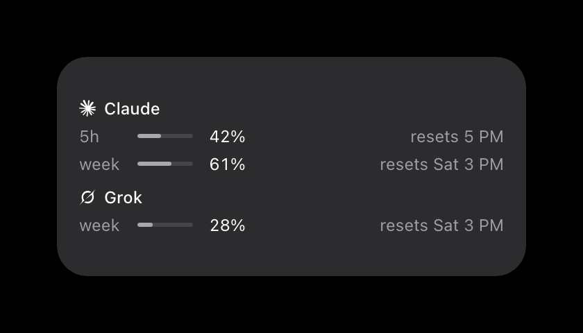

<p align="center">
  
</p>

<h1 align="center">lil agents · lil usage</h1>

<p align="center">A live status overlay for Claude Code, Codex CLI &amp; Grok CLI sessions on macOS, plus Home Screen widgets for weekly usage on iPhone.</p>

---

**Stop alt-tabbing to check if your AI coding agent is done.** `lil agents` (aka **AgentDeck**) is a tiny, native macOS menu-bar app that shows the live status of every [Claude Code](https://docs.anthropic.com/en/docs/claude-code), [OpenAI Codex CLI](https://developers.openai.com/codex/), and [Grok CLI](https://x.ai) session in an always-on-top overlay — working, idle, or waiting for you — and lets you jump straight to the terminal pane that needs attention.

**lil usage** is the iPhone companion in the same repo: a host app and Home Screen widgets for Claude, Codex, and Grok weekly usage. Sign in on the phone, or optionally copy CLI tokens from the Mac.

> Built for developers running **multiple AI agents in parallel** across terminal tabs and windows. One glance tells you which session is blocked on a permission prompt, which finished its turn, and which is still crunching.


<p align="center">
  
  &nbsp;&nbsp;
  
</p>

<p align="center"><sub>The always-on-top overlay (left) — compact by default, with opt-in weekly usage gauges above the session list — and the menu-bar menu (right), with usage, per-session status, agent, and last-update time.</sub></p>

<p align="center">
  
</p>

<p align="center"><sub>Settings — launch at login, track sessions, which states alert you, background agents, opt-in AI usage, Send tokens to iPhone, and uninstall.</sub></p>

<p align="center">
  
  &nbsp;&nbsp;
  
</p>

<p align="center"><sub>lil usage on iPhone — the host app (left) and Home Screen widgets (right).</sub></p>

---

## lil agents

When you drive several coding agents at once, they spend most of their time out of sight — in a background tab, another window, or a pane you scrolled away from. You end up context-switching constantly just to check "is it waiting on me yet?"

`lil agents` collapses that whole problem into a **single traffic-light glance**:

- 🔴 **Red** — a session is **blocked on a permission / approval prompt** and needs you *now*.
- 🟡 **Yellow** — a session **finished its turn** and is waiting for your next prompt.
- 🟢 **Green** — a session is **actively working** (running a tool or thinking).

Click any session and it **jumps to the exact terminal pane that owns it** — across iTerm2, Terminal.app, WezTerm, and tmux — no more hunting through windows. And if you'd rather be told than glance, it can post a **Notification Center alert** (with optional sound) the moment a session needs you.

### Features

- **Real-time agent monitoring** — tracks Claude Code, Codex CLI, and Grok CLI sessions as they start, work, prompt, and finish.
- **Automatic session cleanup** — removes a session when its CLI process exits (including terminal tab, pane, or window closure) and replaces the old row when `/clear`, `/new`, or another in-process reset starts a new lifecycle. A detached tmux session stays visible while its agent is still alive.
- **Floating overlay** — a compact, translucent, always-on-top list of live sessions; hover a row to reveal which agent owns it. Toggle it anywhere with a global hotkey (**⌥⌘J**).
- **Menu bar status icon** — the menu-bar glyph changes color to reflect the most attention-worthy session (red → yellow → green), so you know the state without even opening the overlay. When usage tracking is on, weekly percent for each enabled provider sits next to it.
- **Opt-in usage gauges** — Settings toggles for Claude, Codex, and Grok. Off by default. The overlay and menu-bar icon show Claude's **5-hour** window and Codex/Grok **weekly**; the dropdown also lists Claude's weekly window. Grok's weekly number is the same limit as `/usage` in the TUI.
- **Send tokens to iPhone** — optional. Settings → **Send tokens to iPhone** copies those same CLI sign-ins into iCloud Keychain so **lil usage** on your iPhone can use them. Same Apple ID, iCloud Keychain on, on this Mac and the phone. Can take a minute. Off by default. The iPhone app still works without this — tap Sign in there.
- **One-click jump to terminal** — click a session (in the overlay or the menu) to focus the exact pane that owns it. Precise focus for **iTerm2, Terminal.app, WezTerm, and tmux** (matched by controlling TTY / pane id); **Ghostty** gets precise split focus too via its AppleScript API (working-directory match on 1.3.0+, exact TTY match on 1.4.0+/tip), falling back to bringing the app forward on older builds.
- **Notification Center alerts** — optionally get a banner (and sound) the instant a session goes **🔴 needs-approval** or **🟡 finished-its-turn**. Fires once per transition; tap the alert to jump straight to that pane. Fully configurable in **Settings** (which states, sound, on/off).
- **Project-aware labels** — each session is labeled by its working-directory name, so you can tell your repos apart at a glance.
- **Stay awake (lid closed)** — an optional toggle keeps your Mac awake with the lid shut, so long agent runs don't get suspended mid-task.
- **Optional session tracking** — on by default. Settings → **Track sessions** installs the CLI hooks and shows the overlay and session list. Off uninstalls those hooks, hides the overlay, and leaves usage in the menu bar. Set `AGENTDECK_NO_INSTALL=1` to skip hook file mutation. Claude/Codex configs are merged in place; invalid JSON is left untouched, and the file is not rewritten if our entries are already correct. Grok's hook file is fully owned.
- **Private by design** — everything is local. Events are sent over **loopback only** (`127.0.0.1:54173`), never your LAN, never the internet.
- **Native & lightweight** — pure Swift 6, SwiftUI + AppKit, no Electron, no bundled runtime. Dock-less and unobtrusive (`LSUIElement`).

### How it works

`lil agents` installs small **lifecycle hooks** into the CLIs you already use:

- **Claude Code** → `~/.claude/settings.json`
- **Codex CLI** → `~/.codex/hooks.json`
- **Grok CLI** → `~/.grok/hooks/agentdeck.json`

On each lifecycle event — `SessionStart`, `UserPromptSubmit`, `PreToolUse`, `Notification`, `Stop`, `SubagentStop`, and `SessionEnd` for Claude Code; `SessionStart`, `UserPromptSubmit`, `PreToolUse`, `PermissionRequest`, `Stop`, and `SessionEnd` for Codex CLI; `SessionStart`, `UserPromptSubmit`, `PreToolUse`, `Notification`, `Stop`, `StopFailure`, `StopCancelled`, `SubagentStop`, and `SessionEnd` for Grok CLI — a tiny generated forwarder script reads the hook's JSON, tags it with the terminal's TTY and owning CLI PID, and `POST`s it to the app's local listener. The app maps those events to a coarse status (`working` / `idle` / `waitingApproval`) and updates the overlay and menu-bar icon instantly. It fingerprints and watches the owning process so abrupt terminal closure still ends the right session without being confused by macOS reusing a PID.

The forwarder attributes each event to the CLI process that actually owns it — the nearest ancestor whose command name is the tool, or, for interpreter-backed installs where that name is the runtime rather than the script, the nearest `node`/`bun`/`deno` — and reads the TTY from that process alone. Agents increasingly spawn other agents, and a nested headless run (`codex exec`, `claude -p`, grok headless, CI) has no pane of its own; it is reported as headless and stays out of the overlay rather than borrowing the parent agent's pane and PID. Turn on **Settings → Sessions → Show background agents** if you want them listed anyway — useful when an agent you *are* waiting on runs outside a terminal, such as an editor-hosted session. If the owner can't be identified at all, the event carries a TTY for the jump feature but claims no PID — an unsubstantiated ownership claim would hand one session's row to another.

```
Claude Code / Codex CLI / Grok CLI
        │  (lifecycle hook fires)
        ▼
 forward-event.sh  ──POST──▶  127.0.0.1:54173/event  ──▶  lil agents overlay + menu bar
 (adds tty/PID/tool/event)        (loopback only)          🔴 🟡 🟢  +  jump-to-pane
```

Existing hooks from other tools and plugins are preserved — the installer only ever adds or removes its own entries. Invalid JSON is left untouched. If our entries are already correct, the file is not rewritten.

Grok's `~/.grok/hooks/agentdeck.json` is fully owned. Grok also scans `~/.claude/settings.json` by default (`[compat.claude] hooks = true`). Users with Claude-only hooks should set `[compat.claude] hooks = false` in `~/.grok/config.toml`. Grok tracking does not need the Claude copy.

### Requirements

- **macOS 26 or later**
- **Swift 6.2 toolchain** (Xcode 26+) to build from source
- A supported terminal for click-to-jump — **[iTerm2](https://iterm2.com/)**, **Terminal.app**, **[WezTerm](https://wezterm.org/)**, or **[tmux](https://github.com/tmux/tmux)** for precise pane focus (**[Ghostty](https://ghostty.org/)** 1.3.0+ also gets precise split focus via its AppleScript API; older Ghostty falls back to app-activate). Sessions are still *tracked* in any terminal — this only affects jump-to-pane.
- **[Claude Code](https://docs.anthropic.com/en/docs/claude-code)**, **[Codex CLI](https://developers.openai.com/codex/)**, and/or **[Grok CLI](https://x.ai)** installed — whichever agents you want to monitor

### Download & Install

The easiest way to get `lil agents` is a signed, notarized build from the [Releases page](https://github.com/alfonsocartes/lil-agents/releases):

1. Download the latest `lil-agents-<version>.dmg`.
2. Open the `.dmg` and drag **lil agents.app** onto the **Applications** shortcut.
3. Launch it from Applications (or Spotlight).

Releases are signed with a Developer ID certificate and notarized by Apple, so macOS Gatekeeper opens it right up — no "unidentified developer" warning, no need to right-click → Open.

`lil agents` has no Dock icon and no main window; look for it in the **menu bar**.

### Updating

`lil agents` checks for updates automatically in the background via [Sparkle](https://sparkle-project.org/) and will prompt you when a new version is ready to install.

To check manually: menu bar → **Check for Updates…**

### Usage

| Action | How |
| --- | --- |
| Show / hide the overlay | Global hotkey **⌥⌘J**, or the menu-bar menu (only while **Track sessions** is on) |
| Jump to a session's terminal | Click the session row (overlay) or menu item, or tap its notification |
| Configure notifications | Menu bar → **Settings…** (**⌘,**) |
| Launch at login | Settings → **Launch at login** |
| Track sessions | Settings → **Track sessions** (on by default; off uninstalls hooks and hides the overlay) |
| Show weekly usage | Settings → **AI usage** (Claude / Codex / Grok, off by default) |
| Send tokens to iPhone | Settings → **Send tokens to iPhone** (off by default) |
| Keep Mac awake with lid closed | Menu bar → **Stay awake (lid closed)** |
| Quit | Menu bar → **Quit lil agents** (**⌘Q**) |

Status at a glance:

| Dot | Meaning |
| --- | --- |
| 🟢 Green | Working — running a tool or thinking |
| 🟡 Yellow | Idle — finished its turn, waiting for your prompt |
| 🔴 Red | Needs input — blocked on a permission/approval prompt |

## lil usage

`lil usage` is an iPhone app plus Home Screen widgets for **Claude**, **Codex**, and **Grok** weekly usage. Claude also shows its 5-hour window. Same repo as `lil agents`; it is not a Mac extra.

Sign in on the phone — Safari for Claude, device-code for Codex and Grok. Tokens live in the app's Keychain.

Optional: on the Mac, Settings → **Send tokens to iPhone** copies the CLI sign-ins into iCloud Keychain. Same Apple ID, iCloud Keychain on, on this Mac and the phone. Can take a minute. The iPhone app works without this.

### Widgets

- **Stack** — every signed-in provider.
- **Provider** — one provider. Touch and hold the widget, tap **Edit Widget**, and pick Claude, Codex, or Grok.

Add them: touch and hold the Home Screen → **Edit** → **Add Widget** → search **lil usage**.

### Build & run

Not on the App Store yet. Source-build only.

Open `iOS/LilUsage.xcodeproj` in Xcode 26+ (iOS 18+). If you change targets, regenerate the project with [XcodeGen](https://github.com/yonaskolb/XcodeGen) from `iOS/project.yml`.

Forkers must set their own `DEVELOPMENT_TEAM` (currently `S74M2P6469` in `iOS/project.yml` and `iOS/LilUsage.xcodeproj/project.pbxproj`). App Group `group.com.wandity.lilagents` and the Keychain access group (`$(AppIdentifierPrefix)group.com.wandity.lilagents`) must stay in lockstep across the app and the widget.

## Privacy & security

- **Loopback only.** Session events stay on `127.0.0.1:54173`. The listener is never exposed to the network.
- **No product telemetry.** There is no analytics, no account, no cloud of ours.
- **Usage is opt-in.** Session tracking never leaves the machine. On the Mac, **Settings → AI usage** reads that CLI's local sign-in and asks Anthropic, OpenAI, or xAI for your current usage. Off by default. On the iPhone, usage uses tokens from **Sign in** on the phone or from the Mac's iCloud Keychain share.
- **Tokens stay in Keychain.** iCloud Keychain share is an explicit Mac toggle (**Settings → Send tokens to iPhone**), off by default.
- **Non-destructive config edits.** Claude/Codex configs are merged in place (invalid JSON is left untouched; already-correct entries are not rewritten). Turning **Track sessions** off, or using Settings → Uninstall, removes only what `lil agents` added (`~/.grok/hooks/agentdeck.json` is deleted whole because that file is ours).

## Install & build

### macOS (`lil agents`)

To build from source instead of downloading a release, clone and build the `.app` with the included script:

```bash
git clone https://github.com/alfonsocartes/lil-agents.git
cd lil-agents
scripts/build-app.sh          # release build → dist/lil agents.app
open "dist/lil agents.app"
```

Or build the raw binary with SwiftPM:

```bash
swift build -c release
```

Run the test suite with:

```bash
swift test
```

On launch, hooks install automatically while **Settings → Track sessions** is on (the default; idempotent; set `AGENTDECK_NO_INSTALL=1` to skip). Turning that switch off uninstalls the hooks. Start (or restart) a Claude Code, Codex, or Grok session — it should appear in the overlay immediately.

> **First-run permissions:** macOS will show a one-time **Automation** prompt so the app can control your terminal when you jump to a pane. Local source builds are ad-hoc code-signed (release downloads are Developer ID signed and notarized), which is enough for this grant to persist across launches.

### iOS (`lil usage`)

```bash
open iOS/LilUsage.xcodeproj
```

Xcode 26+, iOS 18+. If you change targets, regenerate with XcodeGen from `iOS/project.yml`. There is no iOS release disk image; source-build only for now. See [lil usage](#lil-usage) for the team ID and App Group.

## Uninstalling

Menu bar → **Settings…** (**⌘,**) → **Uninstall lil agents…**

This removes everything `lil agents` added to your system:

- Its hook entries from `~/.claude/settings.json` and `~/.codex/hooks.json` (existing entries from other tools are left untouched), and `~/.grok/hooks/agentdeck.json`
- The generated forwarder scripts
- The launch-at-login item, if it was enabled
- The **stay awake (lid closed)** `sudoers` rule, if it was ever enabled
- Its other support files (logs, generated config, etc.)

It then reveals **lil agents.app** in Finder so you can drag it to the Trash yourself — the uninstaller never deletes the app bundle for you.

## Tech stack

Swift 6 · SwiftUI · AppKit · WidgetKit · UsageCore · Network.framework (embedded loopback listener) · UserNotifications · Carbon global hotkey · AppleScript/osascript + CLI (iTerm2 / Terminal.app / WezTerm / tmux / Ghostty automation) · Sparkle (auto-updates) · SwiftPM.

## Releasing (maintainer)

Releases are fully automated by [`.github/workflows/release.yml`](.github/workflows/release.yml):

1. Push a tag matching `vX.Y.Z` (e.g. `v0.2.0`) to `main`.
2. The workflow builds the app, re-signs it with a Developer ID certificate, notarizes and staples it, packages `lil-agents-<version>.zip` (the Sparkle update archive) and `lil-agents-<version>.dmg` (the first-download disk image), updates `appcast.xml` with the new release entry and pushes it back to `main`, and publishes a GitHub Release with both artifacts attached.
3. Existing installs pick up the update automatically the next time Sparkle checks the feed.

The workflow needs the following repository secrets configured under **Settings → Secrets and variables → Actions**:

| Secret | Purpose |
| --- | --- |
| `MACOS_CERTIFICATE_P12` | Base64-encoded `.p12` export of the Developer ID Application certificate + private key |
| `MACOS_CERTIFICATE_PASSWORD` | Password the `.p12` was exported with |
| `APPLE_DEVELOPER_ID` | Signing identity string, e.g. `Developer ID Application: Your Name (TEAMID)` |
| `APPLE_ID` | Apple ID email used for notarization |
| `APPLE_TEAM_ID` | 10-character Apple Developer Team ID |
| `APPLE_APP_PASSWORD` | App-specific password for `notarytool` (not your Apple ID password) |
| `SPARKLE_PRIVATE_KEY` | Sparkle EdDSA private key (base64, from `generate_keys`) used to sign update archives |

`GITHUB_TOKEN` is supplied automatically by Actions and is used to push the appcast update and create the release.

## Roadmap ideas

- Per-session elapsed-time and turn counts

Contributions and issues welcome. See [CONTRIBUTING.md](CONTRIBUTING.md).

## License

Released under the [MIT License](LICENSE). © 2026 Wandity Ltd.

---

<sub>**Keywords:** Claude Code monitor · Codex CLI status · Grok CLI status · Grok usage · Claude usage · Codex usage · iOS usage widgets · Home Screen widgets · AI coding agent dashboard · macOS menu bar app · terminal session overlay · parallel AI agents · iTerm2 jump-to-pane · Claude Code hooks · Codex hooks · Grok hooks · agent session tracker · SwiftUI menu bar app.</sub>
